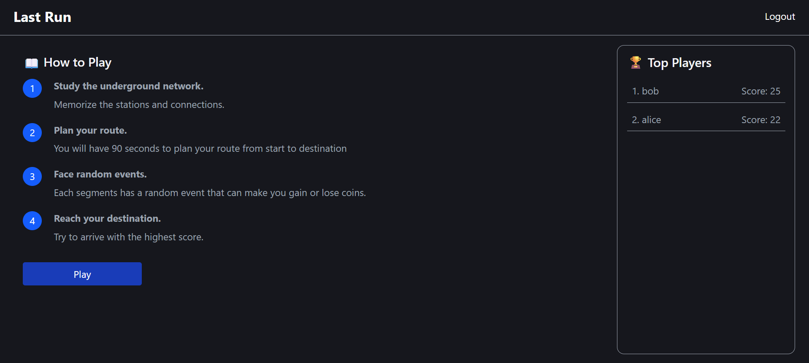

# Exam #1: "Last Race"

## Student: s358708 Azizi Kamyar

## React Client Application Routes

- Route `/login`: User authentication page where users enter username and password to log in. (unprotected)
- Route `/instructions`: Instructions page accessible without authentication, shows game rules. (unprotected)
- Route `/home`: Main home page that displays instructions and a "Play" button to start the game. It also shows the leaderboard on the right side with top scores. (protected route)
- Route `/game/setup`: Setup phase, displays the transit network map for 10 seconds and players need to memorize the network structure. (protected route)
- Route `/game/planning`: Planning phase, where players select a route between two randomly generated stations. Players select segments to build a valid path from start to destination within the time limit. (protected route)
- Route `/game/execution`: Execution phase, displays the chosen route segments sequentially with random events and their effects on coin count. (protected route)
- Route `/game/result`: Result page, displays the final score based on remaining coins. Shows any route validation errors and provides options to play again or return to the leaderboard. (protected route)

## API Server

- POST `/api/sessions` - User login
  - request body: `{username: string, password: string}`
  - response: `{id: number, username: string}`
- DELETE `/api/sessions/current` - User logout
  - request body: none
  - response: `{message: "Logout successful"}`
- GET `/api/sessions/current` - Check current session
  - request body: none
  - response: `{id: number, username: string}`
- GET `/api/games/leaderboard` - Get game leaderboard
  - request body: none
  - response: `[{username: string, score: number}, ...]`
- GET `/api/games/network` - Get transit network map
  - request body: none
  - response: `{lines: {[lineName]: [stationName, ...]}, segments: [{from: string, to: string, line: string}, ...]}`
- GET `/api/games/random-stations` - Get random start and destination stations
  - request body: none
  - response: `{start: string, destination: string}`
- POST `/api/games/validate-route` - Validate a planned route
  - request body: `{start: string, destination: string, segments: [{from: string, to: string}, ...]}`
  - response: `{valid: true, baseCoins: number, events: [{description: string, effect: number}, ...], finalCoins: number}`
- POST `/api/games/leaderboard` - Add game score to leaderboard
  - request body: `{score: number}`
  - response: `{message: "Score added to leaderboard.", username: string, score: number}`

## Database Tables

- Table `users` - contains id, username, hashed_password, salt
- Table `events` - contains id, description, effect
- Table `lines` - contains id, name
- Table `stations` - contains id, name
- Table `line_stations` - contains id, line_id, station_id, stop_number
- Table `games` - contains id, user_id, score

## Main React Components

- `AppLayout` (in `client/src/components/ui/AppLayout.tsx`): Top-level layout wrapper.
- `Router` (in `client/src/components/features/auth/Router.tsx`): App routing and session check, protects routes.
- `Login` (in `client/src/components/features/auth/Login.tsx`): Login form handling username/password inputs.
- `Home` (in `client/src/components/features/home/Home.tsx`): Main dashboard shown after login, displays short instructions and the `Leaderboard` with a Play button.
- `Leaderboard` (in `client/src/components/features/leaderboard/Leaderboard.tsx`): Fetches and displays top players.
- `Instructions` (in `client/src/components/features/instructions/Instructions.tsx`): Component that renders the game's rules.
- `SetupPage` (in `client/src/components/features/game/setup-phase/SetupPage.tsx`): Setup phase showing the network map and a `Timer` (10s) to memorize the map before planning.
- `PlanningPage` (in `client/src/components/features/game/planning-phase/PlanningPage.tsx`): Planning UI that fetches the network and random stations, lets the player build a route, and submits it for validation. Also has a `Timer` (90s).
- `Timer` (in `client/src/components/features/game/Timer.tsx`): Reusable countdown timer component used in setup and planning.
- `ExecutionPage` (in `client/src/components/features/game/execution-phase/ExecutionPage.tsx`): Plays the chosen route sequentially, showing events and updating coins.
- `ResultPage` (in `client/src/components/features/game/result-phase/ResultPage.tsx`): Final result screen showing the final score, any validation reason, and actions to replay or return home/view the leaderboard.
- `GameContext` (in `client/src/context/GameContext.tsx`): Context provider storing the selected route, events, base/final coins and helpers to update/reset game state.

## Screenshot

## Users Credentials

- alice, password123
- bob, password123
- charlie, password123

## Use of AI Tools

Briefly describe whether you used any AI tools (e.g., ChatGPT, GitHub Copilot, Claude) while working on this project, for which purposes (e.g., clarifying concepts, debugging, generating code), and how you verified or adapted their output.
If you did not use any AI tools, simply state so.
